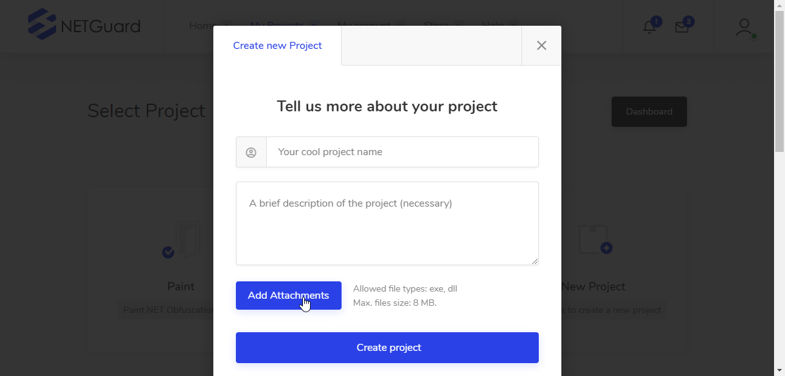
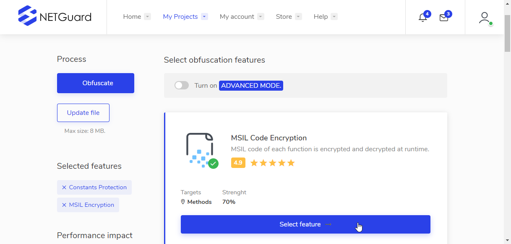
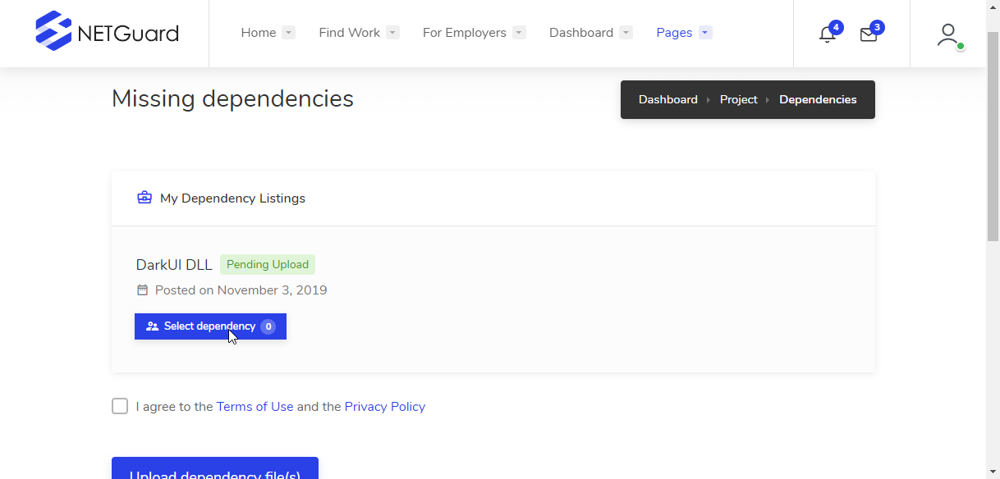
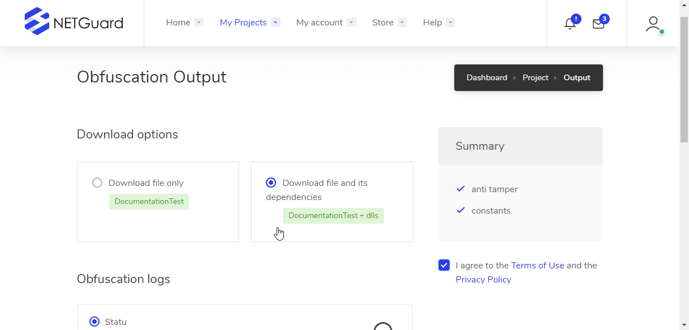

# Getting started

## How to access your NETGuard Dashboard

To start using NETGuard.IO visit [https://netguard.io/panel/register.php](https://netguard.io/panel/register.php) . After registering and logging in to your account, you will be asked to create a new project or to manager your alread-existing ones in your personnal **Dashboard**. From here you will also be able to use the top-menu to visit your **Account Settings**, **Payments History** and **Obfuscation History**.

## Step 1 - Create a new NETGuard project

By clicking on the 'New Project' box you'll be prompted to fill in some informations to create the new project. You will need to enter **Your Application's Name**, and **A Little Description Of Your Application**. Then you are to select the compiled main project's file \(can be a .exe or a .dll file\). One done the application box with automatically be filled with the new project you just created. Click on it to be sent to the Project **Obfuscation Settings** page.


Don't forget to fill in all the details if you want NETGuard to allow you to create the project


Initialy you can protect up to 6 different projects, and once you run out of projets to create, you can contact us so we can create new space on our servers for you.

## Step 2 - Project Obfuscation Settings

On this page you will be able to select **Obfuscation Settings** on the right, once clicked they will pop-up creating a list on the left on your screen. If you have a free plan you can select a minimum number of **Ofuscation Settings**, if you have any premium plans \(subscription or pay-per-use\) you can select everyone of them. When you are ready, click '**Obfuscate**'.

On this page you will also be able to update your project main file. We only allow files bellow 8MB size.


Some premium plans have special unlocked features. See [NETGuard.IO store](https://netguard.io/store.php) page for more informations.



The **ADVANCED MODE** is still under construction and will be available very soon !


## **Step 3 - Missing Dependencies Page**

In the case where your project relies on different external dependencies \(.dll library files\) you will be sent to the **Missing Dependencies Page**. On this page, you are only asked to select those external dependencies files so NETGuard can process the obfuscation task. Due to the nature of the process we are to ask you to agree to our Privacy Policy and Terms Of Use.

After that you will be redirected to the **Obfuscation Output page** to download your protected file.

## Step 4 - Obfuscation Output Page

On this page you will be able to download your obfuscated main file alone of with its original external dependencies, all packed in a .zip file \(Windows handle them by default\). This is conveniant in the case you have multiple versions of these external library dependencies.

You have access to the selected features on the right, and the obfuscation engines log un the accordion menu.

If you have any questions or recommendations, please contact us [on our contact page](https://netguard.io/contact.php) and we will reply you back as soon as possible !

